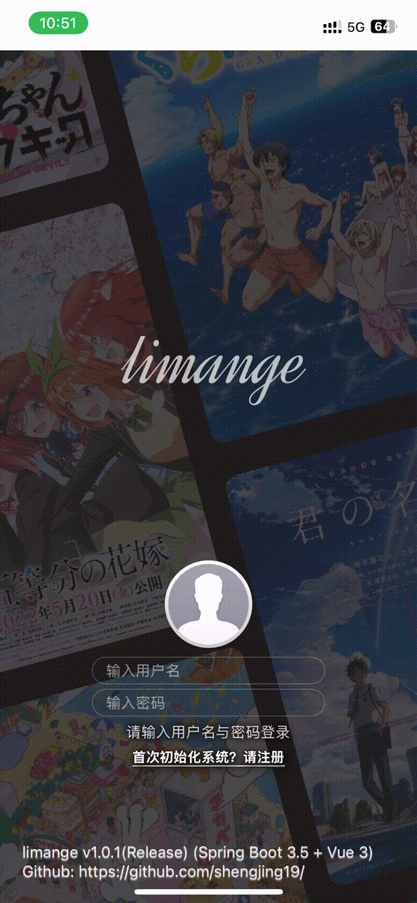
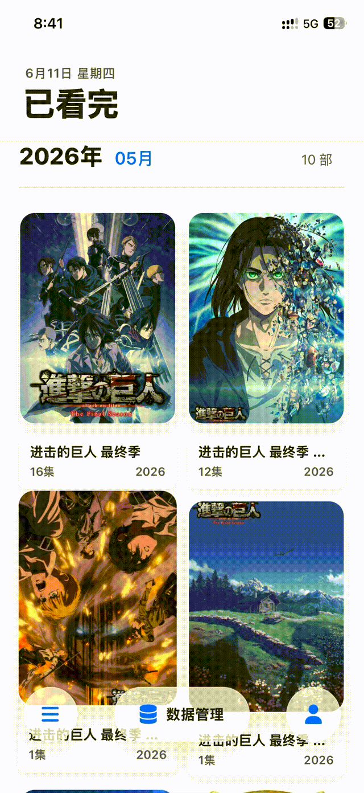
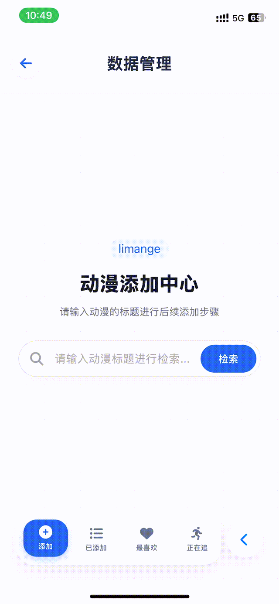
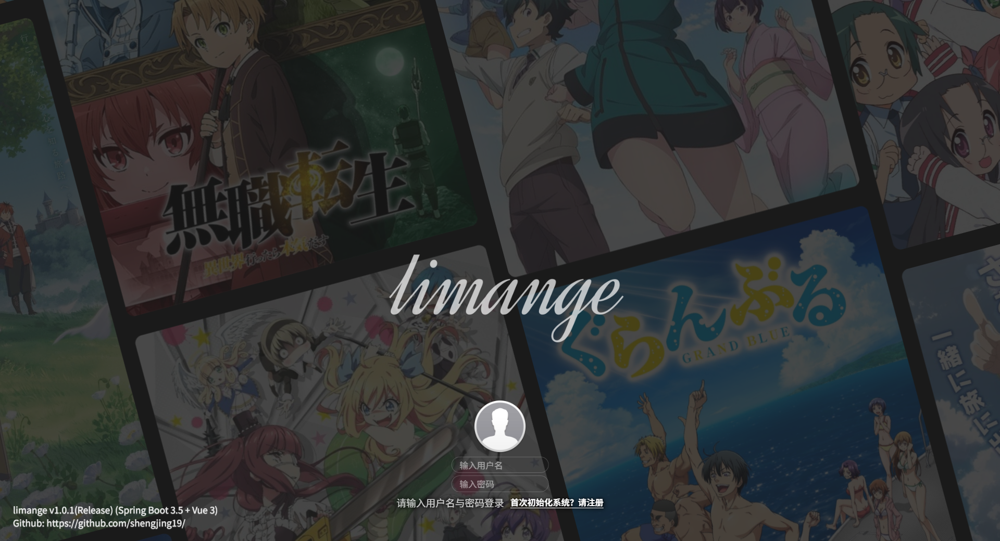
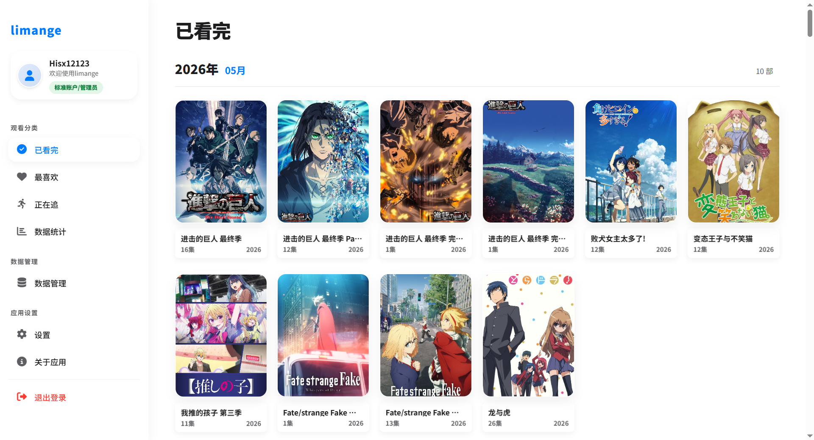
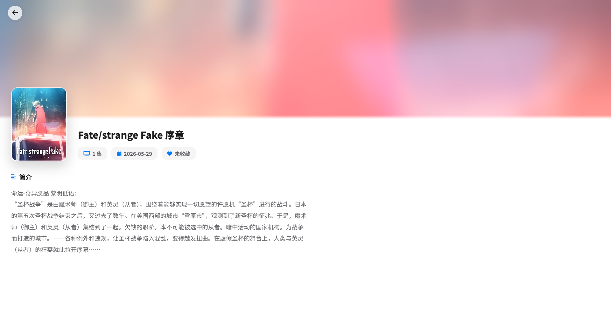
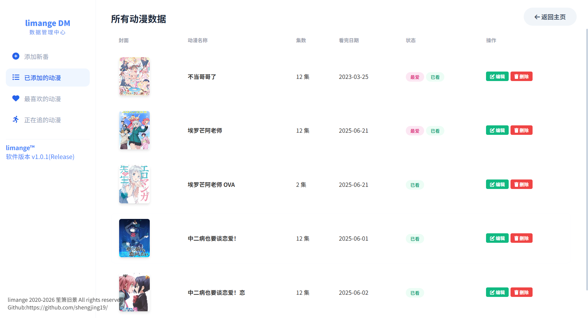
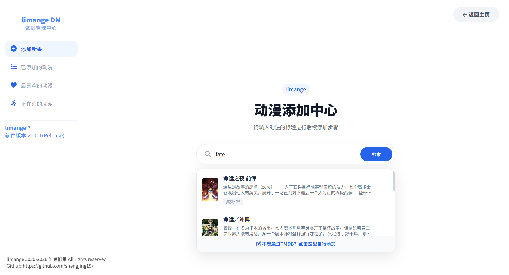

<p align="center">
  
</p>

## 项目概览

`limange_Vue` 是 limange 动漫记录程序的前端项目，项目采用单页应用结构，桌面端使用侧边栏导航，移动端使用底部悬浮导航与二级全屏页面，保证同一套业务在不同设备上拥有合适的操作路径。
<br>Tips:后端项目详见主页Newlimange

## 界面预览(移动端)

移动端围绕手机纵向屏幕做了独立布局，登录、主页浏览与数据管理流程均可在移动设备上完成。

<table>
  <tr>
    <td align="center" width="33%">
      
      <br />
      <sub>登录与初始化</sub>
    </td>
    <td align="center" width="33%">
      
      <br />
      <sub>主页与底部导航</sub>
    </td>
    <td align="center" width="33%">
      
      <br />
      <sub>数据管理与添加中心</sub>
    </td>
  </tr>
</table>

## 界面预览(PC端)

PC 端以侧边栏承载分类导航、数据管理与应用设置，适合在桌面环境下进行浏览和维护。

<table>
  <tr>
    <td align="center" width="50%">
      
      <br />
      <sub>登录页</sub>
    </td>
    <td align="center" width="50%">
      
      <br />
      <sub>主页列表</sub>
    </td>
  </tr>
  <tr>
    <td align="center" width="50%">
      
      <br />
      <sub>动漫详情</sub>
    </td>
    <td align="center" width="50%">
      
      <br />
      <sub>数据管理列表</sub>
    </td>
  </tr>
  <tr>
    <td align="center" colspan="2">
      
      <br />
      <sub>动漫添加中心</sub>
    </td>
  </tr>
</table>

## 技术栈

| 类型 | 技术 |
| --- | --- |
| 核心框架 | Vue 3 |
| 构建工具 | Vite 5 |
| 路由 | Vue Router 4 |
| 状态管理 | Pinia |
| HTTP 客户端 | Axios |
| 图表 | ECharts |
| 动画 | animejs |
| 移动端适配 | postcss-pxtorem + 自定义 flexible |
| 图标 | Font Awesome 6.4.0 |

## 项目结构

```text
limange_Vue/
├── logo.png                         # 项目 Logo
├── index.html                       # Vite 入口 HTML
├── package.json                     # 项目依赖与脚本
├── vite.config.js                   # Vite 与 PostCSS 配置
├── public/
│   ├── img/                         # 静态图片与动漫背景图
│   └── fontawesome6.4.0/            # 本地图标资源
└── src/
    ├── api/                         # Axios 实例与业务 API 封装
    ├── assets/styles/               # 全局样式与变量
    ├── components/                  # 通用组件、布局组件、管理组件
    ├── composables/                 # 通知与确认框组合式能力
    ├── router/                      # 路由与登录守卫
    ├── stores/                      # Pinia 状态
    ├── utils/                       # 常量、工具函数、移动端适配
    └── views/                       # 登录、主页、数据管理页面
```

## 后端接口配置

当前前端 API 地址配置在：

```text
src/utils/constants.js
```

默认配置：

```js
export const API_BASE_URL = 'http://127.0.0.1:8231/api';
export const RESOURCE_BASE_URL = 'http://127.0.0.1:8231/';
```

如后端部署地址发生变化，请同步修改上述配置。

## 主要接口能力

### 认证接口

- `POST /auth/login`：登录并返回 JWT、用户名、演示账户标识。
- `POST /auth/register`：系统初始化注册首个用户。

### 动漫数据接口

- `GET /anime/main`：主页分类列表与统计总览。
- `GET /anime/{id}`：获取动漫详情。
- `GET /anime/list`：管理页分页列表。
- `GET /anime/tmdb/search`：TMDB 动漫检索。
- `POST /anime/add`：新增动漫。
- `POST /anime/update`：更新动漫。
- `DELETE /anime/{id}`：删除动漫。

### 统计接口

- `GET /anime/stats/weekly`：近七天统计。
- `GET /anime/stats/annual`：年度统计。

### 演示账户接口

- `GET /demo-user`：获取演示账户。
- `POST /demo-user`：创建演示账户。
- `PUT /demo-user/password`：修改演示账户密码。
- `DELETE /demo-user`：删除演示账户。

## 本地运行

### 1. 安装依赖

```bash
npm install
```

### 2. 启动开发服务

```bash
npm run dev
```

默认开发服务端口：

```text
http://localhost:3000
```

### 3. 构建生产包

```bash
npm run build
```

### 4. 本地预览构建产物

```bash
npm run preview
```

## 账户与权限说明

### 标准账户/管理员

标准账户可访问全部前端功能：

- 浏览动漫记录。
- 查看统计数据。
- 新增、编辑、删除动漫记录。
- 管理演示账户。
- 修改应用外观设置。

### 演示账户

演示账户用于给访客体验系统，只读访问数据：

- 可登录系统。
- 可查看动漫列表、详情和统计。
- 不可新增、编辑、删除动漫。
- 不可管理演示账户。

前端会隐藏演示账户的写操作入口，并在函数层进行二次拦截。真正的权限边界仍以后端鉴权和 403 响应为准。

## 移动端适配

项目针对移动端做了独立交互设计：

- 使用底部三岛式悬浮导航替代桌面侧边栏。
- “我的”作为移动端个人与设置入口。
- 数据统计、关于应用、演示账户使用全屏二级页面。
- 管理页使用移动端卡片列表。
- `flexible.js` 会根据视口宽度调整根字号。
- `postcss-pxtorem` 将样式中的像素单位转换为 rem，提升跨设备一致性。

## 开发规范说明

- 业务 API 统一封装在 `src/api/anime.js`。
- 鉴权状态统一由 `src/stores/auth.js` 管理。
- 通知与确认框统一由 `src/composables/useNotify.js` 管理。
- 移动端样式集中在对应组件的媒体查询内维护。
- 不建议在组件中直接拼接后端完整 URL，应优先通过 API 封装调用。

## 许可证
[GPL-3.0 License](https://github.com/shengjing19/AnimeRecord-limange_Vue/blob/master/LICENSE)
